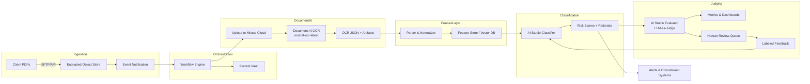

# Target Architecture & Judging Strategy

## 1. End-to-End Flow Overview

1. **Ingestion Layer**
   - PDFs arrive from the client’s legacy OCR system or SFTP drop.
   - Files land in an encrypted object store bucket (e.g., `gs://tier1-risk-inbox`).
   - Event notification (Pub/Sub or SQS) triggers orchestration.

2. **Orchestration & Secrets**
   - A workflow service (Prefect, Temporal, or Step Functions) coordinates each document job.
   - Secrets (API keys, DB credentials) live in a managed vault (AWS Secrets Manager / GCP Secret Manager).

3. **Document AI Processing**
   - Worker uploads the PDF to Mistral Cloud via `client.files.upload`.
   - Retrieves signed URL and calls `client.ocr.process(model="mistral-ocr-latest", table_format="html", include_image_base64=True)`.
   - Multi-page outputs saved back to object store + metadata DB (Postgres/Spanner) keyed by document_id.

4. **Parsing & Feature Store**
   - Parsing service normalizes OCR response into canonical schema (pages, tables, images, entities).
   - Extracted tables serialized as HTML/Parquet; text chunks embedded (e.g., `mistral-embed` model) and written to a vector store for downstream semantic search.
   - Feature builder emits structured entity records (accounts, counterparties, risk metrics) into a feature store (Redis/Mongo/Featureform).

5. **Risk Classification via AI Studio**
   - Two modes:
     - **Online API**: `classification.py` calls an AI Studio hosted prompt/fine-tuned model for each document, producing risk tier, rationale, and confidence.
     - **Batch Jobs**: Documents queued into AI Studio batch endpoints for nightly risk scoring.
   - Outputs stored in `risk_scores` table and pushed to downstream systems (case management, data lake).

6. **Post-Processing & Notifications**
   - Low-confidence cases trigger webhooks to human reviewers.
   - High-risk classifications route to alerting channels (Slack/SNS) with supporting evidence links.

## 2. Data Management & Monitoring
- **Storage**: All intermediate artifacts (signed URLs, OCR JSON, embeddings) versioned with document + processing timestamp.
- **Lineage**: Workflow logs capture every API call (request_id) for auditability.
- **Observability**: Metrics (latency, OCR token usage, classification confidence) exported to Prometheus/Grafana.
- **Security**: PII encrypted at rest, TLS in transit, principle of least privilege enforced for service accounts.

## 3. Judging & Evaluation Strategy
1. **Automated LLM-as-a-Judge**
   - AI Studio evaluation jobs run a dedicated evaluator prompt/model (mirrored in `evaluation.py`’s `LlmJudge`) that compares extraction/classification outputs against ground-truth labels or deterministic rules.
   - Each batch emits a `MetricsSummary` JSON artifact (agreement rate, accuracy vs. truth, avg. confidence, disagreement payloads) that feeds dashboards or data warehouses.

2. **Drift & Regression Detection**
   - Daily evaluator runs compute population statistics; significant drops trigger PagerDuty alerts.
   - Embedding distribution drift monitored via cosine distance thresholds.

3. **Human-in-the-Loop Review**
   - Workflow automatically escalates:
     - Low confidence (<0.75) classifications.
     - Documents with evaluator disagreement (LLM judge vs. production model).
   - Review UI receives structured payload (OCR excerpts, table HTML, classifier rationale) to accelerate adjudication.
   - Reviewer decisions fed back into labeled dataset for retraining prompts/models.

4. **Ground-Truth Maintenance**
   - Maintain a stratified validation set of financial statements (by industry, geography, language).
   - Quarterly relabeling cycle using sampling + reviewer audits to ensure label freshness.

5. **Quality Reporting**
   - Weekly dashboard summarizing:
     - Volume processed, success/error counts.
     - Accuracy metrics per document type.
     - Human override rate and turnaround time.
   - Metrics ingest pipeline reads `MetricsSummary` outputs to populate agreement rate and disagreement drill-down widgets.

## 4. Implementation Artifacts
- `pipeline.py`: orchestrates ingestion → OCR → parsing → feature generation.
- `classification.py`: wraps AI Studio classification endpoints, batching logic, and fallbacks.
- `evaluation.py`: LLM-as-judge harness that produces `EvaluationResult`/`MetricsSummary` payloads for monitoring dashboards.
- `utils.py`: shared helpers (upload, signed URLs, validation, embedding helper, logging).
- `architecture.md`: this document—serves as alignment artifact for engineering + partner teams.
- Test assets: sample PDFs + labeled outputs for evaluator baselines.

## 5. Next Actions
1. Implement upload/OCR modules with validation per Phase 3 plan.
2. Build parsing + entity normalization utilities.
3. Stand up AI Studio classifier and evaluator prompts (LLM judge) with tracking metrics.
4. Wire integration tests + evaluation harness to the judging workflow.
